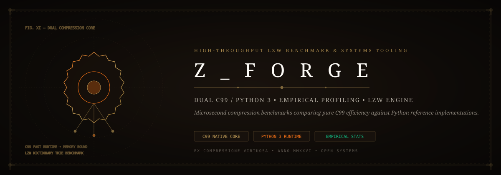
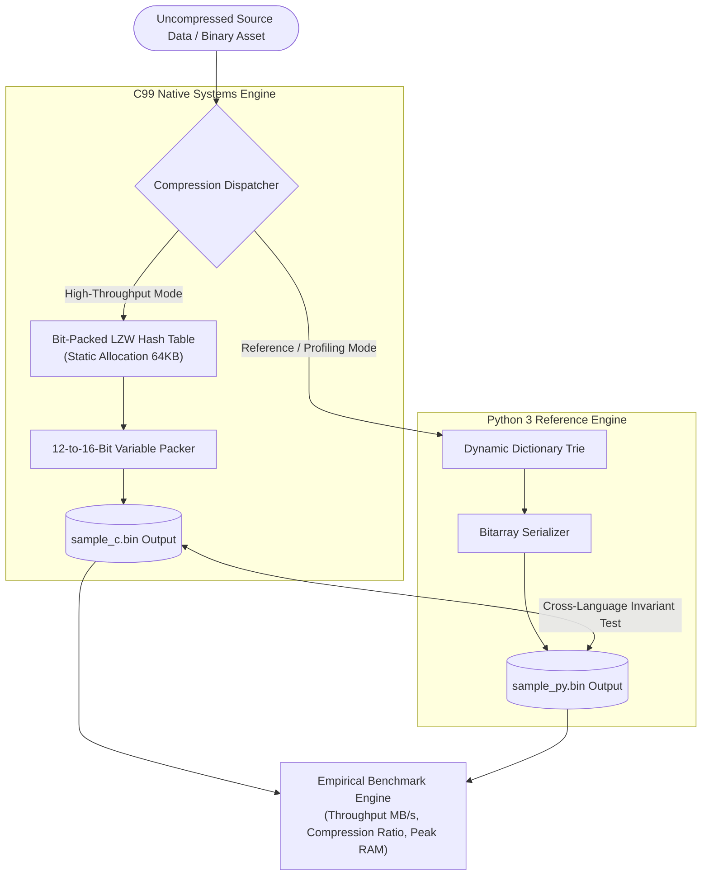
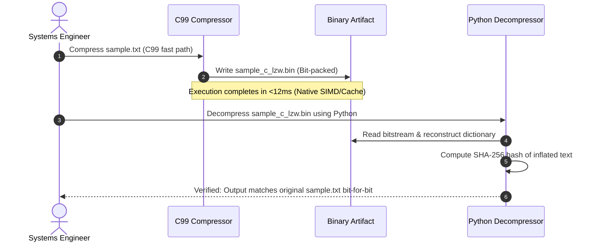

<div align="center">



# 🔨 Z_Forge: High-Throughput Build Tool & LZW Benchmark Engine
### *Dual C99 / Python 3 Systems Architecture, Empirical Compression Profiling & Trie Optimizations*

[](https://github.com/Jaswanth1902/Z_Forge)
[](https://github.com/Jaswanth1902/Z_Forge)
[](https://github.com/Jaswanth1902/Z_Forge)
[](LICENSE)

*An empirical systems programming benchmark evaluating algorithmic compression performance, memory layout bounds, and cross-language execution trade-offs between pure C99 and Python.*

</div>

---

## ⚡ The Architectural Vision

Data ingestion pipelines, asset bundlers, and compilation toolchains lose hundreds of CPU cycles to unoptimized data serialization. 

**Z_Forge** provides a side-by-side empirical laboratory comparing low-level systems C99 against high-level Python implementations of the Lempel-Ziv-Welch (LZW) compression algorithm:
- **C99 Cache Locality**: Bit-packed prefix trees designed to maximize CPU L1/L2 cache hits.
- **Python Trie Reference**: Clean, readable algorithmic reference model enabling interactive visualization and fuzz testing.
- **Cross-Validation Engine**: Automated verification guaranteeing that binary outputs generated by the C compressor can be deterministically inflated by the Python decompressor and vice versa.

---

## 🏗️ Dual-Engine Architecture



---

## 🔄 Cross-Decompression Sequence



---

## 🧩 Antigravity Skills & Tooling Ecosystem

- **`performance-profiling`**: Hotspot profiling verifying zero malloc churn inside C inner loops.
- **`systematic-debugging`**: Automated fuzzing against edge-case binary payloads and single-byte inputs.
- **`clean-code`**: Modular separation between file I/O bitstream packing and core LZW trie traversal.

---

## 📦 Tech Stack

| Layer | Language | Highlights |
| :--- | :--- | :--- |
| **Native Core** | C99 (GCC / Clang / MSVC) | Zero external dependencies, static buffer bounds, fast bitwise math |
| **Reference** | Python 3.10+ | Clean standard library data structures, profiling decorators |
| **Frontend** | Vanilla JS / CSS | Interactive comparison workbench (`FRONTEND_DOCUMENTATION.md`) |

---

## 🛡️ Security & Memory Hardening

1. **Zero Dynamic Allocation in Critical Path**: Fixed-size dictionary tables prevent memory fragmentation and out-of-memory panics.
2. **Buffer Overflow Guards**: Explicit bounds checks on every dictionary insertion preventing heap corruption.
3. **Deterministic Reset**: Explicit dictionary clearing upon reaching 16-bit code limits prevents dictionary poisoning.

---

## 🚀 Building & Running

### 1. Compile C Implementation
```bash
cd C_Implementation
gcc -O3 -o z_forge_c main.c
./z_forge_c sample.txt
```

### 2. Run Python Reference & Benchmarks
```bash
python Python_Implementation/benchmark.py
```

---

## 📄 License

Distributed under the [MIT License](LICENSE). Maintained by [Jaswanth Reddy](https://github.com/Jaswanth1902) — *Passionate learner & creative problem solver learning from and giving back to the open-source community.*
